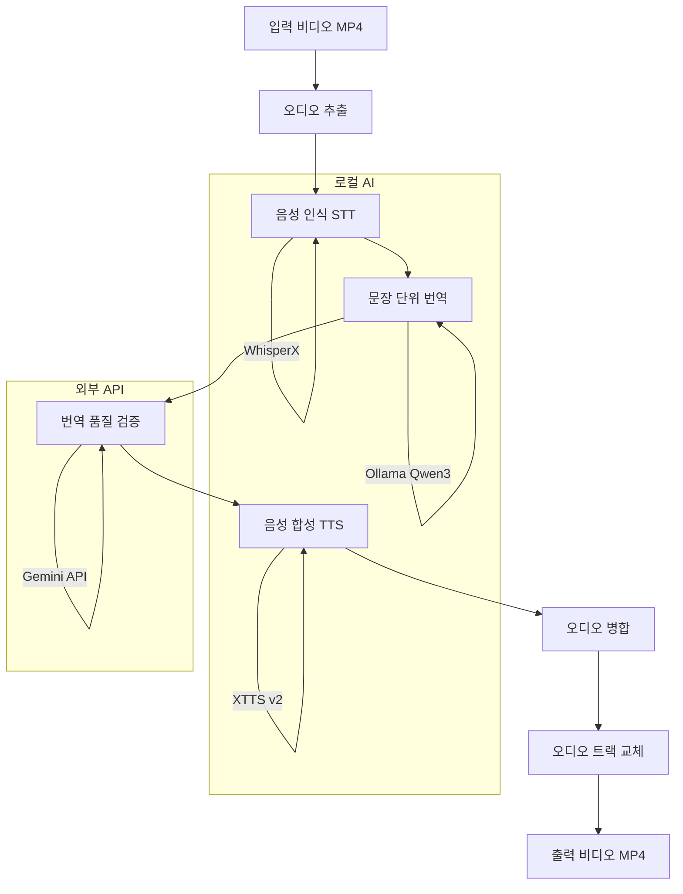

# 시스템 아키텍처

VideoVoice 로컬 다국어 비디오 음성 변환 시스템의 전체 구조를 설명합니다.

## 시스템 개요



## 컴포넌트

| 컴포넌트 | 기술 | 역할 |
|----------|------|------|
| 오디오 추출 | FFmpeg | 비디오에서 오디오 분리 |
| 음성 인식 | WhisperX large-v3 | 음성 → 타임스탬프 텍스트 |
| 번역 | Ollama + Qwen3 14B | 다국어 문장 번역 |
| 품질 검증 | Gemini API | 번역 품질 1~100% 평가 |
| 음성 합성 | XTTS v2 | 텍스트 → 음성 생성 |
| 오디오 교체 | FFmpeg | 새 오디오로 비디오 생성 |

## 하드웨어 요구사항

- **GPU**: RTX 3060 12GB (필수)
- **RAM**: 64GB
- **저장소**: 로컬 SSD
- **네트워크**: Gemini API 호출용 (품질 검증만)

## 데이터 흐름

```
input.mp4
    ↓
audio.wav (16kHz, mono)
    ↓
transcription.json (타임스탬프 포함)
    ↓
translation.json (번역된 문장)
    ↓
quality_report.json (품질 평가)
    ↓
segments/*.wav (TTS 오디오)
    ↓
merged_audio.wav
    ↓
output.mp4
```
