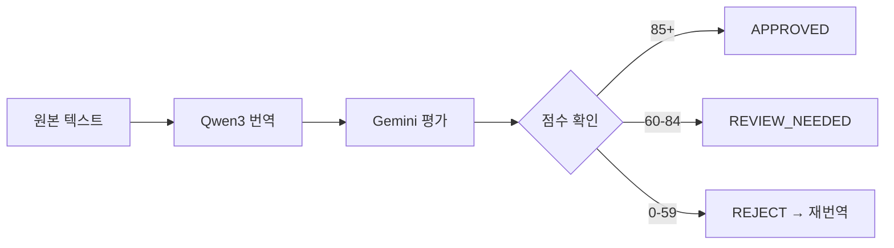

# 번역 품질 평가 시스템

Gemini API를 활용한 번역 품질 자동 평가 시스템입니다.

## 개요

로컬 LLM(Qwen3)으로 생성된 번역 결과를 Gemini API가 검증하여 1~100% 품질 점수를 산출합니다.

## 평가 기준

| 항목 | 가중치 | 설명 |
|------|--------|------|
| 의미 정확도 | 40% | 원문 의미 정확히 전달 |
| 자연스러움 | 30% | 대상 언어에서 자연스러움 |
| 더빙 적합성 | 20% | 길이, 발음 용이성 |
| 일관성 | 10% | 용어/어조 일관성 |

## 권장사항 기준

| 점수 | 권장사항 | 조치 |
|------|----------|------|
| 85~100 | APPROVED | 바로 사용 가능 |
| 60~84 | REVIEW_NEEDED | 수동 검토 권장 |
| 0~59 | REJECT | 재번역 필요 |

## API 호출 예시

```python
import google.generativeai as genai
import json

genai.configure(api_key=os.environ["GEMINI_API_KEY"])
model = genai.GenerativeModel("gemini-2.0-flash")

prompt = f"""Evaluate translation quality for video dubbing.

Original (Korean): {original_text}
Translation (English): {translated_text}

Respond in JSON:
{{"overall_score": <1-100>, "breakdown": {...}, "issues": [...], "recommendation": "..."}}"""

response = model.generate_content(prompt)
result = json.loads(response.text)
```

## 출력 형식

```json
{
  "overall_score": 85,
  "breakdown": {
    "accuracy": 90,
    "naturalness": 82,
    "dubbing_fit": 80,
    "consistency": 88
  },
  "issues": [
    "문장 3: 직역으로 어색함",
    "문장 7: 길이 초과"
  ],
  "recommendation": "APPROVED"
}
```

## 워크플로우



## 비용 최적화

- 전체 번역을 배치로 평가 (API 호출 최소화)
- 무료 티어 활용 (분당 요청 제한 주의)
- 품질 이슈 있는 세그먼트만 개별 재평가
